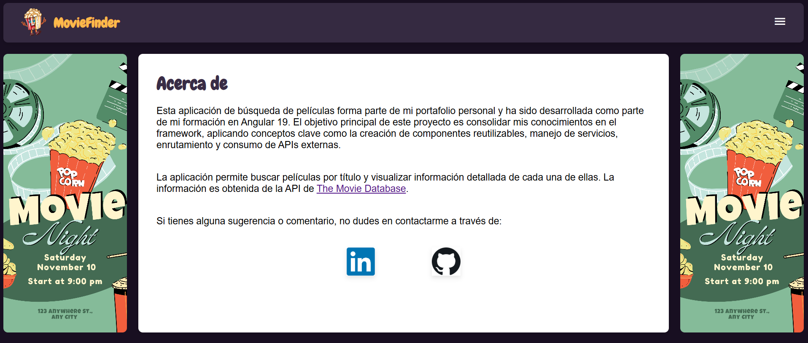

# MovieFinder 🎬

MovieFinder es un proyecto desarrollado con Angular 19.0.0 que sirve como introducción a esta potente herramienta de desarrollo frontend. Este proyecto tiene como objetivo explorar las funcionalidades básicas y avanzadas de Angular, proporcionando una base sólida para construir aplicaciones dinámicas e interactivas.

El objetivo principal de MovieFinder es buscar, filtrar y mostrar información sobre películas, sirviendo como una práctica inicial y didáctica para profundizar en Angular 19.

Accede a este link para visualizar el proyecto en producción.

Visualiza el proyecto en el siguente enlace: [MovieFinder](https://main.d2vjyg47loas9v.amplifyapp.com/)


## Servidor de desarrollo

Para iniciar un servidor de desarrollo local, ejecuta:

```bash
ng serve
```

Una vez que el servidor esté en funcionamiento, abre tu navegador y navega a `http://localhost:4200/`. La aplicación se recargará automáticamente cada vez que modifiques cualquiera de los archivos fuente.

## Generación de código

Angular CLI incluye potentes herramientas de generación de código. Para generar un nuevo componente, ejecuta:

```bash
ng generate component component-name
```

Para obtener una lista completa de los esquemas disponibles (como `components`, `directives` o `pipes`), ejecuta:

```bash
ng generate --help
```

## Construcción

Para construir el proyecto, ejecuta:

```bash
ng build
```

Esto compilará tu proyecto y almacenará los artefactos de construcción en el directorio `dist/`. Por defecto, la construcción de producción optimiza tu aplicación para rendimiento y velocidad.


## Recursos adicionales

Para obtener más información sobre el uso de Angular CLI, incluidas referencias detalladas de comandos, visita la página [Angular CLI Overview and Command Reference](https://angular.dev/tools/cli).

## Imágenes

<!-- imagenes -->

<div style="text-align: center;">
    
</div>
<div style="text-align: center;">
    
</div> 
<div style="text-align: center;">
    
</div>
<div style="text-align: center;">
    
</div>
<div style="text-align: center;">
    
</div>


